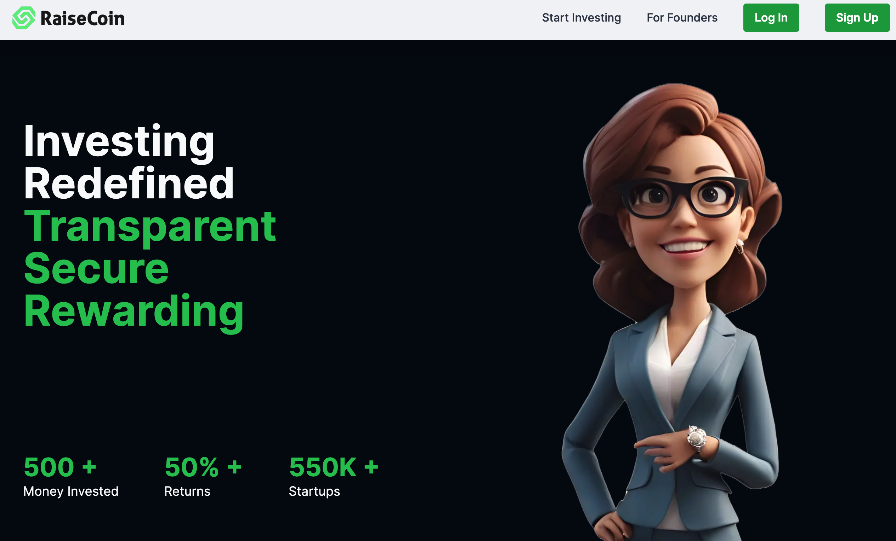
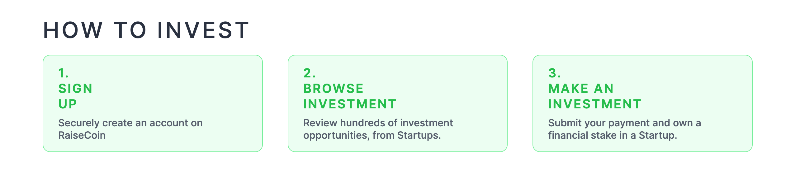

# RaiseCoin DApp

Raisecoin is a revolutionary project aimed at addressing the global challenge of taking projects public and raising funds across the globe. 

Traditional geographical boundaries and limitations often hinder project reach and funding opportunities.

 Raisecoin seeks to eliminate these barriers using blockchain technology, providing a decentralized, transparent, and secure platform for global fundraising.

## Key Features

- **Decentralization**: Utilizing the power of blockchain to ensure trust and transparency, even with users located miles away.
- **Global Currency**: Leveraging cryptocurrency for secure and transparent transactions.
- **Base Blockchain**: Chosen for its future scalability and ability to handle numerous transactions efficiently with low gas fees.

## Contract Address[Deployed on Base Testnet network]
0x85c8629306c1976C1F3635288a6fE9BBFA4453ED

## Live Website Link
[Link Demo](https://raise-coin.vercel.app/)

## Technology Stack

### Frontend
- **Next.js**: We chose Next.js for its robust features, including server-side rendering, static site generation, and a rich ecosystem that enhances the performance and scalability of our application.
- **Tailwind CSS**: Tailwind CSS allows for highly customizable and responsive designs with utility-first CSS classes. This ensures our UI is both attractive and user-friendly.

### Backend
- **PostgreSQL**: PostgreSQL is a powerful, open-source relational database system known for its reliability, robustness, and performance. It handles our data storage needs efficiently, ensuring data integrity and security.
- **Node.js**: Node.js is used for its event-driven, non-blocking I/O model, making it ideal for building scalable and real-time applications. It powers our backend services, providing fast and reliable performance.

### Storage
- **IPFS**: The InterPlanetary File System (IPFS) is a distributed file storage protocol that allows for decentralized storage and sharing of files. It ensures data persistence and integrity across the network.
- **Centralized Storage**: We use centralized storage for specific data types that require high-speed access and regular updates. This hybrid approach balances the benefits of decentralization with the practical needs of performance and manageability.

## Project Aim

Our primary focus is to provide a user-friendly and aesthetically pleasing UI/UX, addressing a significant gap in the Web3 space. We believe that an intuitive and engaging interface is crucial for the success and adoption of blockchain projects. As we progress, we will continue to enhance and refine the user experience.

## Contributing

We welcome contributions to enhance Raisecoin. To contribute:
1. Fork the repository.
2. Create a new branch (`git checkout -b feature/your-feature-name`).
3. Commit your changes (`git commit -m 'Add some feature'`).
4. Push to the branch (`git push origin feature/your-feature-name`).
5. Open a pull request.

## ScreenShot

## **Author**: Harsh Agrawal & Venky Kumar

- **`GitHub`**: [harshagrawal2503](https://github.com/harshagrawal2503)
- **`GitHub`**: [BoddepallyVenkatesh06](https://github.com/BoddepallyVenkatesh06)
